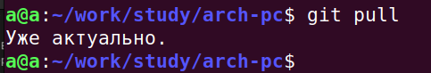
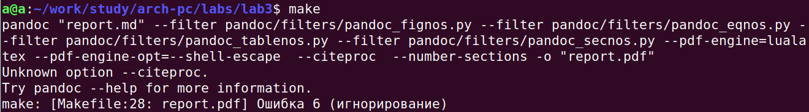
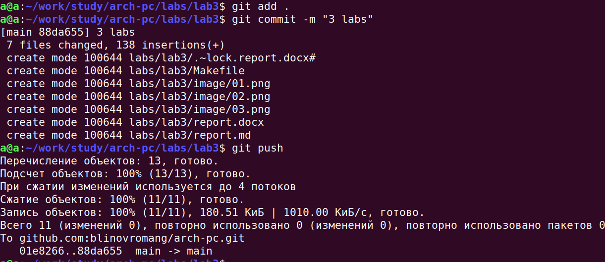
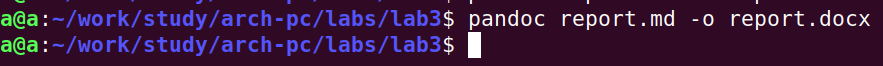

# Цель работы
 Целью работы является освоение процедуры оформления отчетов с помощью легковесного
языка разметки Markdown.

# Задание

1. Откройте терминал
2. Перейдите в каталог курса сформированный при выполнении лабораторной работы
№2:
cd ~/work/study/2023-2024/"Архитектура компьютера"/arch-pc/
Обновите локальный репозиторий, скачав изменения из удаленного репозитория с помо-
щью команды
git pull
3. Перейдите в каталог с шаблоном отчета по лабораторной работе № 3
cd ~/work/study/2023-2024/"Архитектура компьютера"/arch-pc/labs/lab03/report
4. Проведите компиляцию шаблона с использованием Makefile. Для этого введите ко-
манду make
При успешной компиляции должны сгенерироваться файлы report.pdf и report.docx.
Откройте и проверьте корректность полученных файлов.
5. Удалите полученный файлы с использованием Makefile. Для этого введите команду
make clean
Проверьте, что после этой команды файлы report.pdf и report.docx были удалены.
6. Откройте файл report.md c помощью любого текстового редактора, например gedit
gedit report.md
Внимательно изучите структуру этого файла.
7. Заполните отчет и скомпилируйте отчет с использованием Makefile. Проверьте корректность полученных файлов. (Обратите внимание, для корректного отображения
скриншотов они должны быть размещены в каталоге image)
8. Загрузите файлы на Github.
cd ~/work/study/2023-2024/"Архитектура компьютера"/arch-pc
git add .
git commit -am 'feat(main): add files lab-3'
git push
9. Задание для самостоятельной работы
    * В соответствующем каталоге сделайте отчёт по лабораторной работе № 2 в формате
Markdown. В качестве отчёта необходимо предоставить отчёты в 3 форматах: pdf, docx
и md.
    * Загрузите файлы на github.

# Выполнение лабораторной работы

Открыли терминал и перешли в каталог курса, сформированный при выполнении работы №2
cd ~/work/study/2023-2024/"Архитектура компьютера"/arch-pc/
Обновили локальный репозиторий, скачав изменения из удаленного репозитория с помощью команды git pull

{#fig:001 width=100%}

Перешли в каталог с шаблоном отчета по лабораторной работе № 3
cd ~/work/study/2023-2024/"Архитектура компьютера"/arch-pc/labs/lab03/report
Провели компиляцию шаблона с использованием Makefile. Для этого ввели команду make
Сгенерировали файлы report.pdf и report.docx

Удалили полученные файлы с использованием Makefile. Для этого ввели команду
make clean
Проверили, что после этой команды файлы report.pdf и report.docx были удалены
Не скачен TeX Live, поэтому нет пдф файла.

{#fig:002 width=100%}

Загрузили файлы на Github.
cd ~/work/study/2023-2024/"Архитектура компьютера"/arch-pc
git add .
git commit -am 'feat(main): add files lab-3'
git push

{#fig:003 width=100%}

В соответствующем каталоге сделали отчёт по лабораторной работе № 3 в формате
Markdown. Получили отчёт в 2 форматах: docx и md.
Загрузили файлы на github 

{#fig:004 width=100%}

# Выводы

В этой работе мы научились работать с языком Markdown используя средства командной строки.

# Список литературы 
1. The GNU Project Debugger. — URL: https://www.gnu.org/software/gdb/.
2. GNU Bash Manual. — 2016. — URL: https://www.gnu.org/software/bash/manual
3. Midnight Commander Development Center. — 2021. — URL: https://midnight-commander.
org/
4. NASM Assembly Language Tutorials. — 2021. — URL: https://asmtutor.com/.
5. Newham C. Learning the bash Shell: Unix Shell Programming. — O’Reilly Media, 2005. —
354 с. — (In a Nutshell). — ISBN 0596009658. — URL: http://www.amazon.com/Learning-
bash-Shell-Programming-Nutshell/dp/0596009658.
6. Robbins A. Bash Pocket Reference. — O’Reilly Media, 2016. — 156 с. — ISBN 978-1491941591.
7. The NASM documentation. — 2021. — URL: https://www.nasm.us/docs.php.
8. Zarrelli G. Mastering Bash. — Packt Publishing, 2017. — 502 с. — ISBN 9781784396879.
9. Колдаев В. Д., Лупин С. А. Архитектура ЭВМ. — М. : Форум, 2018.
10. Куляс О. Л., Никитин К. А. Курс программирования на ASSEMBLER. — М. : Солон-Пресс,
2017.
11. Новожилов О. П. Архитектура ЭВМ и систем. — М. : Юрайт, 2016.
12. Расширенный ассемблер: NASM. — 2021. — URL: https://www.opennet.ru/docs/RUS/nasm/.
13. Робачевский А., Немнюгин С., Стесик О. Операционная система UNIX. — 2-е изд. — БХВ-
Петербург, 2010. — 656 с. — ISBN 978-5-94157-538-1.
14. Столяров А. Программирование на языке ассемблера NASM для ОС Unix. — 2-е изд. —
М. : МАКС Пресс, 2011. — URL: http://www.stolyarov.info/books/asm_unix.
15. Таненбаум Э. Архитектура компьютера. — 6-е изд. — СПб. : Питер, 2013. — 874 с. —
(Классика Computer Science)
16. Таненбаум Э., Бос Х. Современные операционные системы. — 4-е изд. — СПб. : Питер,2015 — 1120 с. — (Классика Computer Science)

