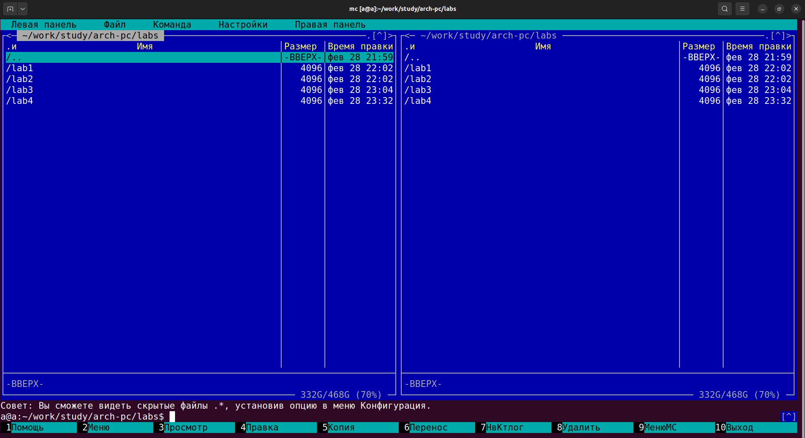
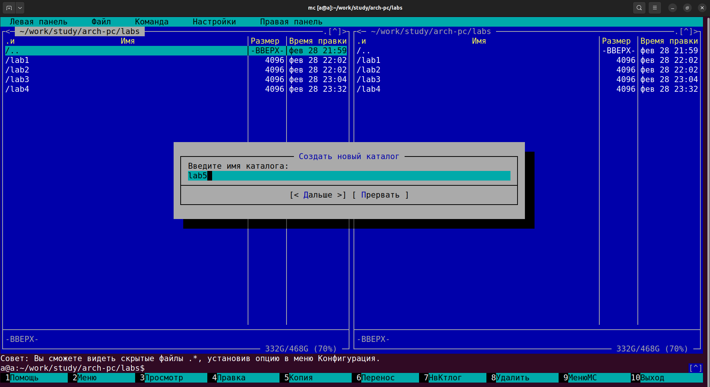
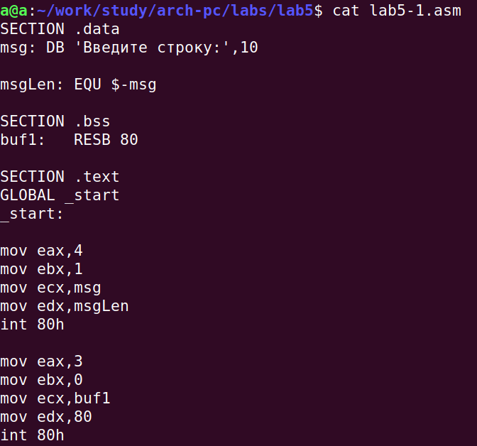
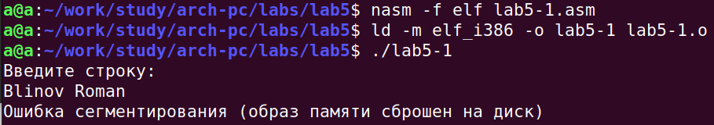
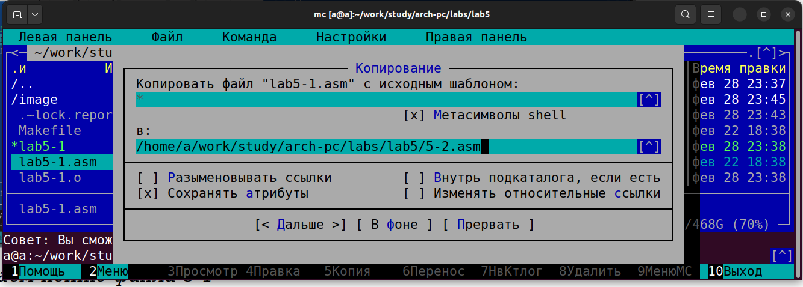
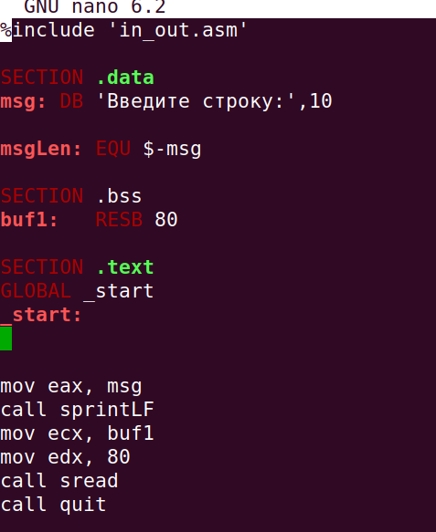
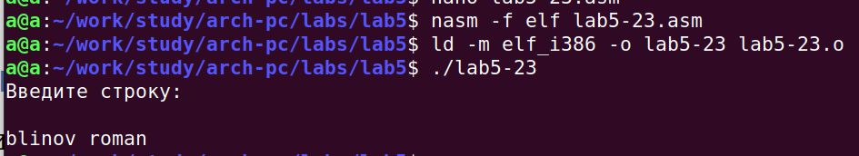

# Цель работы

Приобрести навыки работы в Midnight Commander. Использовать инструкции
языка ассемблера mov и int.

# Задание

1. Создайте копию файла lab5-1.asm. Внесите изменения в программу (без использова-
ния внешнего файла in_out.asm), так чтобы она работала по следующему алгоритму:
* вывести приглашение типа “Введите строку:”;
* ввести строку с клавиатуры;
* вывести введённую строку на экран.

2. Получите исполняемый файл и проверьте его работу. На приглашение ввести строку
введите свою фамилию.

3. Создайте копию файла lab5-2.asm. Исправьте текст программы с использование под-
программ из внешнего файла in_out.asm, так чтобы она работала по следующему
алгоритму:
* вывести приглашение типа “Введите строку:”;
* ввести строку с клавиатуры;
* вывести введённую строку на экран.

4. Создайте исполняемый файл и проверьте его работу

# Выполнение лабораторной работы

1. Открыли Midnight Commander
user@dk4n31:~$ mc

{#fig:001 width=100%}

2. Перешли в каталог ~/work/arch-pc созданный при выполнении лабораторной работы №4 
3. С помощью функциональной клавиши F7 создали папку lab05 и перешли
в созданный каталог.

{#fig:002 width=100%}

4. Пользуясь строкой ввода и командой touch создали файл lab5-1.asm 

{#fig:003 width=100%}

5. Код файла lab5-1.asm для записи фамилии

{#fig:004 width=100%}

6. Оттранслировали тип файла в объектный файл, выполнили компоновку и запустили полученный файл

{#fig:006 width=100%}

7. Создана копия файла lab5-1.asm - lab5-2.asm

{#fig:007 width=100%}

8. Редактируем файл с учетом использования in_out.asm

{#fig:008 width=100%}

9. Проверена корректная работа файла lab5-2.asm

{#fig:009 width=100%}

# Выводы

Приобрели базовые навыки работы в Midnight Commander. Использовали инструкции
языка ассемблера mov и int.

# Список литературы 
1. The GNU Project Debugger. — URL: https://www.gnu.org/software/gdb/.
2. GNU Bash Manual. — 2016. — URL: https://www.gnu.org/software/bash/manual
3. Midnight Commander Development Center. — 2021. — URL: https://midnight-commander.
org/
4. NASM Assembly Language Tutorials. — 2021. — URL: https://asmtutor.com/.
5. Newham C. Learning the bash Shell: Unix Shell Programming. — O’Reilly Media, 2005. —
354 с. — (In a Nutshell). — ISBN 0596009658. — URL: http://www.amazon.com/Learning-
bash-Shell-Programming-Nutshell/dp/0596009658.
6. Robbins A. Bash Pocket Reference. — O’Reilly Media, 2016. — 156 с. — ISBN 978-1491941591.
7. The NASM documentation. — 2021. — URL: https://www.nasm.us/docs.php.
8. Zarrelli G. Mastering Bash. — Packt Publishing, 2017. — 502 с. — ISBN 9781784396879.
9. Колдаев В. Д., Лупин С. А. Архитектура ЭВМ. — М. : Форум, 2018.
10. Куляс О. Л., Никитин К. А. Курс программирования на ASSEMBLER. — М. : Солон-Пресс,
2017.
11. Новожилов О. П. Архитектура ЭВМ и систем. — М. : Юрайт, 2016.
12. Расширенный ассемблер: NASM. — 2021. — URL: https://www.opennet.ru/docs/RUS/nasm/.
13. Робачевский А., Немнюгин С., Стесик О. Операционная система UNIX. — 2-е изд. — БХВ-
Петербург, 2010. — 656 с. — ISBN 978-5-94157-538-1.
14. Столяров А. Программирование на языке ассемблера NASM для ОС Unix. — 2-е изд. —
М. : МАКС Пресс, 2011. — URL: http://www.stolyarov.info/books/asm_unix.
15. Таненбаум Э. Архитектура компьютера. — 6-е изд. — СПб. : Питер, 2013. — 874 с. —
(Классика Computer Science)
16. Таненбаум Э., Бос Х. Современные операционные системы. — 4-е изд. — СПб. : Питер,2015 — 1120 с. — (Классика Computer Science)

